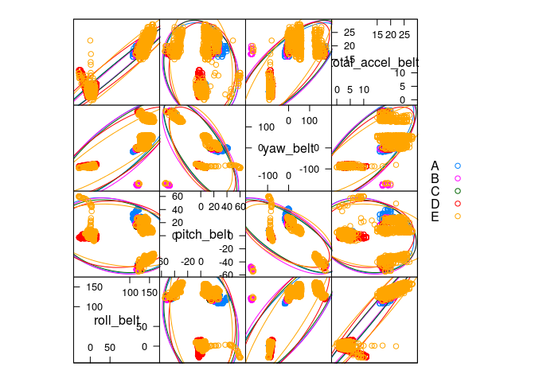
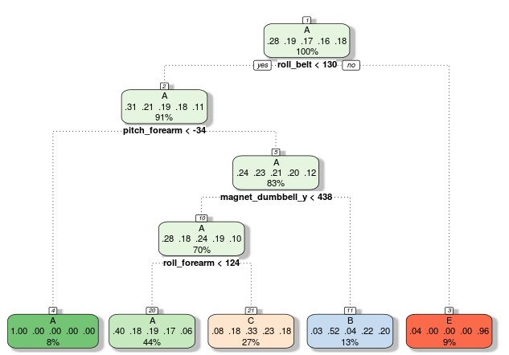
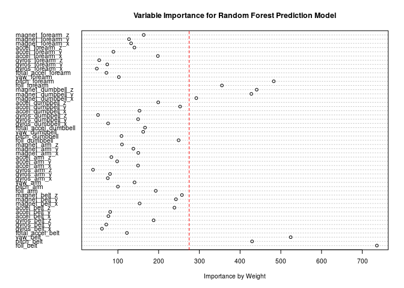

# Machine Learning Project: \n Johns Hopkins Data Science Certificate Track  
Zecca Lehn <https://github.com/ZeccaLehn>  
08/19/2014  


## Executive Summary 

This assignment seeks to describe our validated machine learning technique, for predicting one of five exercise classifications, based on observations related to body building. Based on previous Human Activity Recognition (HAR) wearable device data was originally measured from 4 subjects wearing accelerometers at the waist, left thigh, right arm, and right ankle. Source HAR data was trained and tested via partition during this project, using the original 165,633 samples satisfying cross-validation requirements.
 
In the partitioned `trainData`,`testData` and blind `finalTest` data (used in the validated system with 20 observations), 52 of 160 variables were kept and stored in all sets, and final selected and preprocessed algorithms were employed in predicting activities from various body sensor data. There were thousands of missing data points in the *rawData* set for most variables, and large NA/Blank counts in the partitioned *trainData* and *testData* sets prior to initial selection. Names of participants were not used in any runs, as to avoid possible bias of results. No observations (i.e., rows) were removed in the process of using the 52 variable used for training and testing both--which included the 'classe' dependent factor variable as:

- A = Exactly according to the specification
- B = Throwing the elbows to the front
- C = Lifting the dumbbell only halfway
- D = Lowering the dumbbell only halfway
- E = Throwing the hips to the front


Our final unbiased Random Forest model achieved highest adjusted accuracy with both our Training Data and Testing Data after comparing other alternatives in the process. Our final model's success is further confirmed by it's 20 blind out-of-sample multivariate successful predictions, which were submitted and verified as part of the project for Johns Hopkins University. Data will be included in my Git-hub Repo. Please view appropriate reference to the related "Qualitative Activity Recognition of Weight Lifting Exercises" and other sources at the end of this document.

##Data Exploration

The below code, aims to create fully reproducible results using data-frames. 


```r
library(data.table)
library(caret)

#Reads in raw data and removes rows with high NA count
rawData <- read.csv("pml-training.csv", header = TRUE, sep = ",")
rawNames <- names(rawData)
rawData <- fread("pml-training.csv")
names(rawData) <- rawNames
rawData <- rawData[, c(8:11,37:48,60:68,84:86,102,113:124,140,151:160), with = FALSE] # Selects columns with complete data 
# summary(rawData)
# names(rawData)

#Partitions rawData for training and testing
inSample <- createDataPartition(y = rawData$classe, p = 0.6, list = FALSE)
inSample <- as.vector(as.matrix(inSample)) #Vector rownumbers selct data keys
trainData <- rawData[inSample,]  
testData <- rawData[-inSample,]
# length(trainData[[1]])
# length(testData[[1]])

#Matches raw data by column
finalTest <- read.csv("pml-testing.csv", header = TRUE, sep = ",")
rawNames <- names(finalTest)
finalTest <- fread("pml-testing.csv")
names(finalTest) <- rawNames
finalTest <- finalTest[, c(8:11,37:48,60:68,84:86,102,113:124,140,151:160), with = FALSE] # Selects columns with complete data 
names(finalTest)[[53]] <- "classe"
# summary(finalTest)
# dim(trainData)
# dim(testData)
```


The below correlation feature plot, shows the relationship among the first four variables against the dependent 'classe' output variable--includes: A, B, C, D, E. Notice the correlations are high for each classe, and overlap by colored region. Groupings of dependent classes are clustered together, and will limit in sample and out of sample results with a classification model.

 


## Classification Tests
Initial Classification Tree below, uses recursive classification and regression in selecting statistically important/significant variables from the related list. Output probabilities of factors are based on attributes of these select variables. In this case, the `rpart` model was used initially, to gauge accuracies of predicted multivariate factors. The `rpartFit` output shows a low recursive accuracy of 49.9% from re-sampling. `fitPred` confirms the low accuracy of the recursive model, with a large percentage of inaccurate predictions in B through E; A is largely predicted by the first branch of the classification tree.


```r
suppressMessages(library(caret))
suppressMessages(library(rattle))
suppressMessages(library(rpart))

rpartFit <- train(as.factor(classe) ~ . , method = "rpart", data = trainData)
fancyRpartPlot(rpartFit$finalModel)
```

 

```r
fitPred = predict(rpartFit, newdata = testData)
fitTable = table(fitPred, testData$classe)
rpartFit
```

```
## CART 
## 
## 11776 samples
##    51 predictors
##     5 classes: 'A', 'B', 'C', 'D', 'E' 
## 
## No pre-processing
## Resampling: Bootstrapped (25 reps) 
## 
## Summary of sample sizes: 11776, 11776, 11776, 11776, 11776, 11776, ... 
## 
## Resampling results across tuning parameters:
## 
##   cp    Accuracy  Kappa  Accuracy SD  Kappa SD
##   0.04  0.5       0.4    0.01         0.02    
##   0.06  0.5       0.3    0.06         0.1     
##   0.1   0.3       0.05   0.04         0.06    
## 
## Accuracy was used to select the optimal model using  the largest value.
## The final value used for the model was cp = 0.04.
```

```r
fitTable
```

```
##        
## fitPred    A    B    C    D    E
##       A 1993  648  620  583  191
##       B   47  516   51  238  171
##       C  156  354  697  465  390
##       D    0    0    0    0    0
##       E   36    0    0    0  690
```

## Generating a More Robust Approach with Ensemble Method

The Random Forest model is now implemented using this ensemble method for this learning algorithm, versus Bayes or SVMs. Notice the higher accuracy for both in sample and out of sample results in the Confusion Matrices attached. In fact, out of sample results, using 60% of orignial and selected `rawData` for training, and 40% for testing.

[More info on how Random Forests Work](http://citizennet.com/blog/2012/11/10/random-forests-ensembles-and-performance-metrics/)


```r
suppressMessages(library(randomForest))

rf <- randomForest(as.factor(classe) ~ . , trainData)
rfReg <- predict(rf, trainData)
rfPred <- predict(rf, testData)
#table(rfPred, testData$classe)
confusionMatrix(rfReg, trainData$classe)
```

```
## Confusion Matrix and Statistics
## 
##           Reference
## Prediction    A    B    C    D    E
##          A 3348    0    0    0    0
##          B    0 2279    0    0    0
##          C    0    0 2054    0    0
##          D    0    0    0 1930    0
##          E    0    0    0    0 2165
## 
## Overall Statistics
##                                 
##                Accuracy : 1     
##                  95% CI : (1, 1)
##     No Information Rate : 0.284 
##     P-Value [Acc > NIR] : <2e-16
##                                 
##                   Kappa : 1     
##  Mcnemar's Test P-Value : NA    
## 
## Statistics by Class:
## 
##                      Class: A Class: B Class: C Class: D Class: E
## Sensitivity             1.000    1.000    1.000    1.000    1.000
## Specificity             1.000    1.000    1.000    1.000    1.000
## Pos Pred Value          1.000    1.000    1.000    1.000    1.000
## Neg Pred Value          1.000    1.000    1.000    1.000    1.000
## Prevalence              0.284    0.194    0.174    0.164    0.184
## Detection Rate          0.284    0.194    0.174    0.164    0.184
## Detection Prevalence    0.284    0.194    0.174    0.164    0.184
## Balanced Accuracy       1.000    1.000    1.000    1.000    1.000
```

```r
confusionMatrix(rfPred, testData$classe)
```

```
## Confusion Matrix and Statistics
## 
##           Reference
## Prediction    A    B    C    D    E
##          A 2231    6    0    0    0
##          B    0 1509   17    0    0
##          C    0    3 1351   10    0
##          D    0    0    0 1275    3
##          E    1    0    0    1 1439
## 
## Overall Statistics
##                                         
##                Accuracy : 0.995         
##                  95% CI : (0.993, 0.996)
##     No Information Rate : 0.284         
##     P-Value [Acc > NIR] : <2e-16        
##                                         
##                   Kappa : 0.993         
##  Mcnemar's Test P-Value : NA            
## 
## Statistics by Class:
## 
##                      Class: A Class: B Class: C Class: D Class: E
## Sensitivity             1.000    0.994    0.988    0.991    0.998
## Specificity             0.999    0.997    0.998    1.000    1.000
## Pos Pred Value          0.997    0.989    0.990    0.998    0.999
## Neg Pred Value          1.000    0.999    0.997    0.998    1.000
## Prevalence              0.284    0.193    0.174    0.164    0.184
## Detection Rate          0.284    0.192    0.172    0.163    0.183
## Detection Prevalence    0.285    0.194    0.174    0.163    0.184
## Balanced Accuracy       0.999    0.996    0.993    0.995    0.999
```
Here we display a Dot Chart with weight on importance of influence on accuracies. Note that the top 8 variables are used in the next `rfTest`, and show slightly lower accuracies across the multivariate model--indicating a stronger preference for the above `rf` model in our final prediction run.


```r
# Simple Dotplot
imp <- varImp(rf, scale = FALSE)
slices <- imp$Overall
lbls <- rownames(imp)
dotchart(slices, labels = lbls, cex = .65, xlab = "Importance by Weight", main = "Variable Importance for Random Forest Prediction Model")
abline(v = 275, col = "red", lty = 2)
```

 

## Can We Improve our Initial Random Forest Model?
Can we improve the excellent accuracies of our test data (out-of-sample data) by eliminating variables with lower importance? 


```r
rfTest <- randomForest(as.factor(classe) ~ roll_belt + pitch_belt + yaw_belt + magnet_dumbbell_x + magnet_dumbbell_y + magnet_dumbbell_z + roll_forearm + pitch_forearm, data = trainData)
rfRegTest <- predict(rfTest, trainData)
rfPredTest <- predict(rfTest, testData)
table(rfRegTest, trainData$classe)
```

```
##          
## rfRegTest    A    B    C    D    E
##         A 3347    0    0    0    0
##         B    0 2279    0    0    0
##         C    1    0 2054    0    0
##         D    0    0    0 1930    0
##         E    0    0    0    0 2165
```

```r
table(rfPredTest, testData$classe)
```

```
##           
## rfPredTest    A    B    C    D    E
##          A 2207   19    1    0    0
##          B    4 1474   20    2    7
##          C   17   19 1341    6    2
##          D    4    6    6 1276    2
##          E    0    0    0    2 1431
```

```r
#confusionMatrix(rfRegTest, trainData$classe)
#confusionMatrix(rfPredTest, testData$classe)
```
The table above indicates the errors are larger for both training and testing data cases with our 'improved' model. Here, inputs are deselected by relative unimportance--to end with eight 'important' variables.

It turns out importance selection may lead to more error with Random Forest models!

## Final Out-of-Sample Blind Run

Finally, we choose our initial `rf` Random Forest model over both the eight variable `rfTest` alternative and the less qualified 'rpartFit' classification model. 

The below output from `answers` prints unique files per predicted observation. From the output below, our model predicted all twenty blind outcomes with 100% accuracy! Given a larger out of sample observation set, we would expect a 99.5% accuracy(with 95% CI:[0.993, 0.996]) in terms of results, with a 0.5% Error Rate, and a Kappa of 99.3%.


```r
answers <- predict(rf, finalTest)

pml_write_files = function(x){
  n = length(x)
  for(i in 1:n){
    filename = paste0("problem_id_",i,".txt")
    write.table(x[i],file=filename,quote=FALSE,row.names=FALSE,col.names=FALSE)
  }
}

pml_write_files(answers)
```


```r
#answers    ##Uncomment to reproduce results.

#  Answers
#        1  2  3  4  5  6  7  8  9 10 11 12 13 14 15 16 17 18 19 20 
#        B  A  B  A  A  E  D  B  A  A  B  C  B  A  E  E  A  B  B  B 
#        Levels: A B C D E
```


### Primary Sources:
Velloso, E.; Bulling, A.; Gellersen, H.; Ugulino, W.; Fuks, H. Qualitative Activity Recognition of Weight Lifting Exercises. Proceedings of 4th International Conference in Cooperation with SIGCHI (Augmented Human '13) . Stuttgart, Germany: ACM SIGCHI, 2013. <http://groupware.les.inf.puc-rio.br/har> 

[Link to other Source Descriptions](http://groupware.les.inf.puc-rio.br/public/papers/2012.Ugulino.WearableComputing.HAR.Classifier.RIBBON.pdf)

[Link to original Source Data](http://groupware.les.inf.puc-rio.br/har)

### Links and Other Sources:

[Thanks to Neal O'Boyle and Website--various #Rstats multivariate functions.](http://www.redbrick.dcu.ie/~noel/R_classification.html#variableimportance)

[Thanks to authors of R library(caret) package documentation.](http://topepo.github.io/caret/index.html)

[Thanks to the Quick-R website and Robert Kabacoff, Ph.D. for continued inspiration.](http://www.statmethods.net/)
